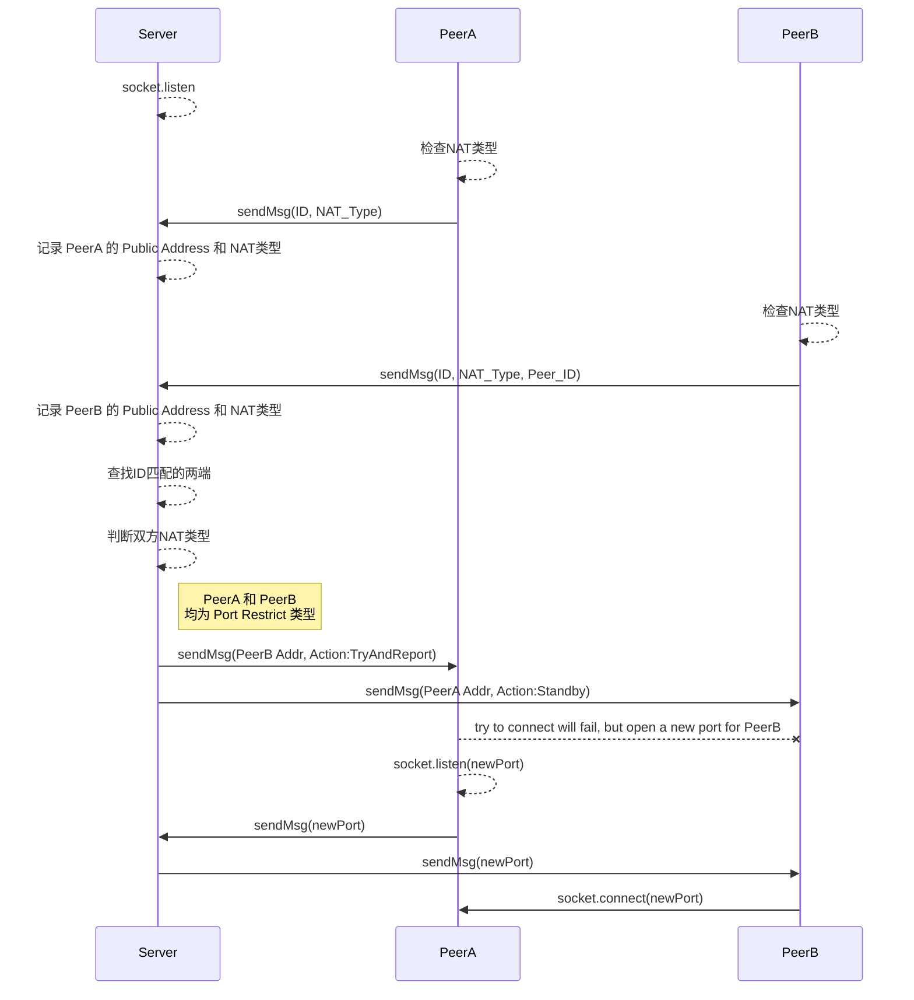

最近有这么一个需求，要测试在两台没有公网IP的服务器之间建立P2P连接。经过几天的学习测试，记录在此。

<!--more-->
## 我现在知道什么

对于P2P打洞这个技术，我此前没有太多了解。对此我的大概认知如下：
1. 需要中间Server做中介交换信息，建立连接后不再依赖中间Server。
2. 没有公网IP的Client虽然不能直接被外部访问到，但可以在发起请求后接收回包。
3. 没有公网IP的Client是通过NAT技术连接网络的。

## 前置知识

经过一番网上冲浪，我了解到：
1. NAT 大致分为四种类型：
    - `Full Cone`
    - `Restric NAT`
    - `Restric Port NAT`
    - `Symmetric NAT`
2. Python库 `pystun` 可以用来检测本地 NAT类型。
3. `pystun` 的 Python3 版本叫 `pystun3`。

### NAT大致分为下面四类

*Note: 此处参考了网上的一些博客，大部分都是转载，我没有找到原文出处，无法在此标注* 

#### 1. Full Cone
这种NAT内部的机器A连接过外网机器S后，NAT会打开一个端口。之后外网的任何发到这个打开的端口的UDP数据报都可以到达A，不管是不是S发过来的。

#### 2. Restricted Cone
这种NAT内部的机器A连接过外网的机器S后，NAT会打开一个端口。之后S可以用任何端口和A通信，但其他的外网机器不行。

#### 3. Port Restricted Cone
这种NAT内部的机器A连接过外网的机器C后，NAT会打开一个端口，之后S可以用原来的端口和A通信，但其他端口不行，其他的外网机器也不行。

#### 4. Symmetic
对于这种NAT，连接不同的外部目标，原来NAT打开的端口会变化，而Cone NAT不会，虽然可以用端口猜测。但是成功的概率很小，这种NAT的UDP打洞难度很大。


## 试验一

看到此处，你可能和我一样，还是比较迷茫的，只是对概念有了一个大致的了解。我做了一个小试验，来点更加直观的认识。  

最简单的试验环境，一台有 PublicIP 的服务器做 Server，两个NAT类型为 Full Cone 的服务器做 Client。

> **Tips:** 哪里有 Full Cone NAT 的服务器？见文末总结。  

一个最简单的Demo代码:
```Python
# Python 3.6 +
# Author: chowyi.com

import sys
import json
import struct
import socket
import threading


def send_msg(sock, msg):
    # Prefix each message with a 4-byte length (network byte order)
    msg = struct.pack('>I', len(msg)) + msg.encode('utf-8')
    sock.sendall(msg)


def recv_by_bytes(sock, n):
    # Helper function to recv n bytes or return None if EOF is hit
    data = b''
    while len(data) < n:
        packet = sock.recv(n - len(data))
        if not packet:
            return None
        data += packet
    return data


def recv_msg(sock):
    # Read message length and unpack it into an integer
    raw_msglen = recv_by_bytes(sock, 4)
    if not raw_msglen:
        return None
    msglen = struct.unpack('>I', raw_msglen)[0]
    # Read the message data
    return recv_by_bytes(sock, msglen).decode('utf-8')


def start_p2p_listen(private_port):
    with socket.socket(socket.AF_INET, socket.SOCK_STREAM) as s:
        s.setsockopt(socket.SOL_SOCKET, socket.SO_REUSEADDR, 1)
        s.setsockopt(socket.SOL_SOCKET, socket.SO_REUSEPORT, 1)
        s.bind(('', private_port))
        s.listen(1)
        s.settimeout(30)
        while True:
            try:
                print('Client try to listen at port {private_port}'.format(private_port=private_port))
                conn, addr = s.accept()
            except socket.timeout:
                print('Client listened timeout at port {private_port}'.format(private_port=private_port))
                continue
            else:
                print('Client listened from peer({addr}).'.format(addr=str(addr)))
                break

        message = recv_msg(conn)
        print('Received Peer message:')
        print(message)
        send_msg(conn, 'Fine, thank you! And you?')


def start_p2p_connect(peer_ip, peer_port):
    with socket.socket(socket.AF_INET, socket.SOCK_STREAM) as s:
        s.setsockopt(socket.SOL_SOCKET, socket.SO_REUSEADDR, 1)
        s.setsockopt(socket.SOL_SOCKET, socket.SO_REUSEPORT, 1)

        count = 3
        while True:
            try:
                print('Client try to connect at {peer_ip}:{peer_port}'.format(peer_ip=peer_ip, peer_port=peer_port))
                s.connect((peer_ip, peer_port))
            except socket.error as e:
                print('Client connect failed at {peer_ip}:{peer_port}'.format(peer_ip=peer_ip, peer_port=peer_port))
                print(str(e))
                count -= 1
                if count < 0:
                    return
            else:
                print('Client connected success to Peer({peer_ip}:{peer_port})'.format(peer_ip=peer_ip, peer_port=peer_port))
                break

        send_msg(s, 'How are you?')
        message = recv_msg(s)
        print('Received Peer message:')
        print(message)


def server(host, port):
    clients = []
    with socket.socket(socket.AF_INET, socket.SOCK_STREAM) as s:
        s.setsockopt(socket.SOL_SOCKET, socket.SO_REUSEADDR, 1)
        s.bind((host, port))
        s.listen(1)
        s.settimeout(30)
        print('Server starting listen at {host}:{port}'.format(host=host, port=port))

        while True:
            try:
                conn, addr = s.accept()
                print('Accepted connection from Client({client_ip}:{client_port})'.format(client_ip=addr[0], client_port=addr[1]))
            except socket.timeout:
                continue
            else:
                clients.append({
                    'conn': conn,
                    'addr': addr
                })
                if len(clients) == 2:
                    print('send peer info')
                    send_msg(
                        clients[1]['conn'],
                        json.dumps({
                            'action': 'listen',
                            'ip': clients[0]['addr'][0],
                            'port': clients[0]['addr'][1]
                        })
                    )
                    send_msg(
                        clients[0]['conn'],
                        json.dumps({
                            'action': 'connect',
                            'ip': clients[1]['addr'][0],
                            'port': clients[1]['addr'][1]
                        })
                    )
                    break


def client(server_host, server_port):
    with socket.socket(socket.AF_INET, socket.SOCK_STREAM) as s:
        s.setsockopt(socket.SOL_SOCKET, socket.SO_REUSEADDR, 1)
        s.connect((server_host, server_port))
        private_addr = s.getsockname()
        print('Server connected. Client private_addr is {private_addr}'.format(private_addr=str(private_addr)))

        while True:
            message = json.loads(recv_msg(s))
            if message['action'] == 'listen':
                t = threading.Thread(target=start_p2p_listen, args=(private_addr[1],))
            elif message['action'] == 'connect':
                t = threading.Thread(target=start_p2p_connect, args=(message['ip'], message['port']))
            else:
                break

            t.start()
            t.join()
            break


if __name__ == '__main__':
    if sys.argv[1] == 'server':
        # 启动服务器
        server('0.0.0.0', 15005)
    elif sys.argv[1] == 'client':
        # 启动客户端
        client(sys.argv[2], int(sys.argv[3]))
    else:
        print('Invalid params')

```

## 建立P2P连接的策略

**试验一** 中的代码是一个最简单的Demo，仅适用于两端 NAT 都是 Full Cone 类型的情况。在这种情况下，Server 只需要帮助两端 Client 交换对方 Public Address，然后两端 Clients 中任意一端 Listen，另一端 Connect 即可。

不幸的是，两端都是 Full Cone NAT 的情况很少见，真实的情况往往更加复杂。4 种NAT类型两两配对，共有 10 种组合。但从建立 P2P 连接的方式来看，这 10 种组合又可以归为 5 大类：

1. 至少有一端是 `Full Cone NAT`
2. 至少有一端是 `Restricted Cone NAT`
3. 两端都是 `Port Restricted Cone NAT`
4. 两端分别是 `Port Restricted Cone NAT` 和 `Symmetric NAT`
5. 两端都是 `Symmetric NAT`

### 1.至少有一端是 `Full Cone NAT`

这种情况比较简单，和两端都是 Full Cone NAT 的情况类似。区别在于，在 Server 帮助两端交换对方的 Public Address 之后，类型为 Full Cone 的一端必须 Listen，另一端 Connect，不可调换。

### 2.至少有一端是 `Restricted Cone NAT`

Restricted Cone NAT 仅允许之前进行过连接的来源 IP 通过，因此这种情况稍微复杂一些。Server 帮助两端交换对方的 Public Address 之后，Restricted Cone 要尝试 Connect 另一端，连接大概率是失败的，所以另一端也不需要 Listen。这一步的目的是让 Restricted Cone NAT 记录另一端的 IP。现在 Restricted Cone 端进入 Listen 状态，另一端 Connect 即可。

### 3.两端都是 `Port Restricted Cone NAT`

这种情况比上一种更复杂一点。Server 帮助两端交换对方的 Public Address 之后，任意一端（称为A端）要尝试 Connect 另一端（称为B端），连接大概率是失败的，所以B端也不需要 Listen。这一步的目的是让 A端的 NAT 记录B端的 IP。之后，A 端要把新开启的 port 发送给 Server，然后 Listen 这个新开启的 port。Server 把新开启的 port 转发给B端，B端再去 Connect 即可。

### 4.两端分别是 `Port Restricted Cone NAT` 和 `Symmetric NAT`

两种类型的 NAT 针对不同来源的IP，都有端口的限制，因此很难实现 P2P 连接。网上的资料表示可用生日攻击来做端口预测，难度较大，暂时跳过。

### 5.两端都是 `Symmetric NAT`

同上。

### 画出两端都是 Port Restricted Cone NAT 的时序图



## 试验二

有了上面的理论，现在可以尝试两端都是 Restricted Cone NAT 的情况。

> **Tips:** 哪里有 Restricted Cone NAT 的服务器？见文末总结。  

在**试验一**的基础上修改代码：
```Python
# 增加一个新函数
def try_p2p_connect(peer_ip, peer_port):
    with socket.socket(socket.AF_INET, socket.SOCK_STREAM) as s:
        s.setsockopt(socket.SOL_SOCKET, socket.SO_REUSEADDR, 1)
        s.setsockopt(socket.SOL_SOCKET, socket.SO_REUSEPORT, 1)
        s.settimeout(3)
        try:
            print('Client try to connecting at {peer_ip}:{peer_port}'.format(peer_ip=peer_ip, peer_port=peer_port))
            print('This try must be failed, just for ready to receive from peer next time.')
            s.connect((peer_ip, peer_port))
        except socket.error:
            return


# client函数修改如下
def client(server_host, server_port):
    with socket.socket(socket.AF_INET, socket.SOCK_STREAM) as s:
        s.setsockopt(socket.SOL_SOCKET, socket.SO_REUSEADDR, 1)
        s.connect((server_host, server_port))
        private_addr = s.getsockname()
        print('Server connected. Client private_addr is {private_addr}'.format(private_addr=str(private_addr)))

        while True:
            message = json.loads(recv_msg(s))
            if message['action'] == 'listen':
                t = threading.Thread(target=start_p2p_listen, args=(private_addr[1],))
            elif message['action'] == 'connect':
                t = threading.Thread(target=start_p2p_connect, args=(message['ip'], message['port']))
            elif message['action'] == 'try_and_listen':
                try_p2p_connect(message['ip'], message['port'])
                t = threading.Thread(target=start_p2p_listen, args=(private_addr[1],))
            elif message['action'] == 'delay_connect':
                time.sleep(3)
                t = threading.Thread(target=start_p2p_connect, args=(message['ip'], message['port']))
            else:
                break

            t.start()
            t.join()
            break
```

## 完善代码

通过了**试验一**和**试验二**之后，就可以继续完成代码了。接下来需要：  
1. Client端检测自己的NAT类型，然后上报给Server端
2. 给Client端增加ID，以便Server可以同时服务多个Client
3. Server端根据Client的ID和请求的对端ID进行匹配
4. Server端根据一对Clients的NAT类型组合，下发相应的连接策略
5. 如果两端都是 Port Restrict Cone NAT，Server 要协助转发消息

完整代码如下：
```Python
# Python 3.6 +
# Author: chowyi.com

import sys
import json
import uuid
import time
import socket
import struct
import threading
import stun

CLIENT_HELLO_MESSAGE = 'ClientHelloMessage'
SERVER_HELLO_MESSAGE = 'ServerHelloMessage'
SERVER_REFUSE_MESSAGE = 'ServerRefuseMessage'
PEER_INFO_MESSAGE = 'PeerInfoMessage'
PEER_HELLO_MESSAGE = 'PeerHelloMessage'
PEER_NOT_FOUND_MESSAGE = 'PeerNotFoundMessage'
PEER_PORT_MESSAGE = 'PeerPortMessage'

ACTION_LISTEN = 'Listen'
ACTION_CONNECT = 'Connect'
ACTION_TRY_AND_LISTEN = 'TryAndListen'
ACTION_DELAY_CONNECT = 'DelayConnect'
ACTION_TRY_AND_REPORT = 'TryAndReport'
ACTION_STANDBY = 'Standby'


def send_msg(sock, msg):
    # Prefix each message with a 4-byte length (network byte order)
    msg = struct.pack('>I', len(msg)) + msg.encode('utf-8')
    sock.sendall(msg)


def recv_by_bytes(sock, n):
    # Helper function to recv n bytes or return None if EOF is hit
    data = b''
    while len(data) < n:
        packet = sock.recv(n - len(data))
        if not packet:
            return None
        data += packet
    return data


def recv_msg(sock):
    # Read message length and unpack it into an integer
    raw_msglen = recv_by_bytes(sock, 4)
    if not raw_msglen:
        return None
    msglen = struct.unpack('>I', raw_msglen)[0]
    # Read the message data
    return recv_by_bytes(sock, msglen).decode('utf-8')


def start_p2p_listen(client_id, private_ip, private_port):
    private_ip = ''
    with socket.socket(socket.AF_INET, socket.SOCK_STREAM) as s:
        s.setsockopt(socket.SOL_SOCKET, socket.SO_REUSEADDR, 1)
        s.setsockopt(socket.SOL_SOCKET, socket.SO_REUSEPORT, 1)
        s.bind((private_ip, private_port))
        s.listen(1)
        s.settimeout(30)
        while True:
            try:
                print('Client({client_id}) try to listening at {private_ip}:{private_port}'.format(client_id=client_id, private_ip=private_ip, private_port=private_port))
                conn, addr = s.accept()
            except socket.timeout:
                print('Client({client_id}) listened timeout at {private_ip}:{private_port}'.format(client_id=client_id, private_ip=private_ip, private_port=private_port))
                continue
            else:
                print('Client({client_id}) listened from peer({addr}).'.format(client_id=client_id, addr=str(addr)))
                break

        while True:
            msg_str = recv_msg(conn)
            if msg_str is None:
                continue
            message = json.loads(msg_str)
            print('Received: {message}'.format(message=str(message)))

            number = message['number']
            number += 1
            peer_hello_message = {
                'type': PEER_HELLO_MESSAGE,
                'content': '[{n}] Hello, this is Client({client_id}).'.format(n=number, client_id=client_id),
                'number': number
            }
            send_msg(conn, json.dumps(peer_hello_message))
            print('Send: {message}'.format(message=str(peer_hello_message)))


def start_p2p_connect(client_id, peer_ip, peer_port):
    with socket.socket(socket.AF_INET, socket.SOCK_STREAM) as s:
        s.setsockopt(socket.SOL_SOCKET, socket.SO_REUSEADDR, 1)
        s.setsockopt(socket.SOL_SOCKET, socket.SO_REUSEPORT, 1)

        while True:
            try:
                print('Client({client_id}) try to connecting at {peer_ip}:{peer_port}'.format(client_id=client_id, peer_ip=peer_ip, peer_port=peer_port))
                s.connect((peer_ip, peer_port))
            except socket.error as e:
                print('Client({client_id}) connect failed at {peer_ip}:{peer_port}'.format(client_id=client_id, peer_ip=peer_ip, peer_port=peer_port))
                print(str(e))
            else:
                print('Client({client_id}) connected success to Peer({peer_ip}:{peer_port})'.format(client_id=client_id, peer_ip=peer_ip, peer_port=peer_port))
                break

        number = 0
        while True:
            number += 1
            peer_hello_message = {
                'type': PEER_HELLO_MESSAGE,
                'content': '[{n}] Hello, this is Client({client_id}).'.format(n=number, client_id=client_id),
                'number': number
            }
            send_msg(s, json.dumps(peer_hello_message))
            print('Send: {message}'.format(message=str(peer_hello_message)))
            message = json.loads(recv_msg(s))
            print('Received: {message}'.format(message=str(message)))
            number = message['number']
            time.sleep(2)


def try_p2p_connect(client_id, peer_ip, peer_port):
    with socket.socket(socket.AF_INET, socket.SOCK_STREAM) as s:
        s.setsockopt(socket.SOL_SOCKET, socket.SO_REUSEADDR, 1)
        s.setsockopt(socket.SOL_SOCKET, socket.SO_REUSEPORT, 1)
        s.settimeout(3)
        try:
            print('Client({client_id}) try to connecting at {peer_ip}:{peer_port}'.format(client_id=client_id, peer_ip=peer_ip, peer_port=peer_port))
            print('This try must be failed, just for ready to receive from peer next time.')
            s.connect((peer_ip, peer_port))
        except socket.error:
            return
        else:
            return s.getsockname()


def p2p_connect_actions(p1, p2):
    """
    根据两端不通的NAT类型组合，决定双方建立p2p连接的步骤
    :return:
    """
    pair = (p1['nat_type'], p2['nat_type'])
    if pair == (stun.SymmetricNAT, stun.SymmetricNAT):
        # 两端都是 SymmetricNAT，打洞难度大，暂时跳过
        return None, None
    if pair == (stun.SymmetricNAT, stun.RestricPortNAT) or pair == (stun.RestricPortNAT, stun.SymmetricNAT):
        # 一端是 SymmetricNAT，另一端是 RestrictPortNAT，打洞难度大，暂时跳过
        return None, None

    if pair == (stun.RestricPortNAT, stun.RestricPortNAT):
        # 两端都是 RestrictPortNAT
        return ACTION_TRY_AND_REPORT, ACTION_STANDBY

    if stun.FullCone in pair:
        # 至少有一端是 FullCone的，共四种组合
        a, b = ACTION_LISTEN, ACTION_CONNECT
        return (a, b) if p1['nat_type'] == stun.FullCone else (b, a)

    if stun.RestricNAT in pair or stun.RestricPortNAT in pair:
        # 四三种组合
        # RestrictNAT - RestrictPortNAT
        # RestrictNAT - RestrictNAT
        # RestrictNAT - SymmetricNAT
        a, b = ACTION_TRY_AND_LISTEN, ACTION_DELAY_CONNECT
        return (a, b) if p1['nat_type'] == stun.RestricNAT else (b, a)


def start_server(host, port):
    clients = {}
    with socket.socket(socket.AF_INET, socket.SOCK_STREAM) as s:
        s.setsockopt(socket.SOL_SOCKET, socket.SO_REUSEADDR, 1)
        s.bind((host, port))
        s.listen(1)
        s.settimeout(30)
        print('Server starting listen at {host}:{port}'.format(host=host, port=port))

        while True:
            try:
                conn, addr = s.accept()
                print('Accepted connection from Client({client_ip}:{client_port})'.format(client_ip=addr[0], client_port=addr[1]))
            except socket.timeout:
                continue

            message = json.loads(recv_msg(conn))

            # 如果是来自客户端的Hello消息
            if message['type'] == CLIENT_HELLO_MESSAGE:
                print('-----Received Client Hello Message-----')
                print('Client ID: {client_id}'.format(client_id=message['client_id']))
                print('Client NAT: {nat_type}'.format(nat_type=message['nat_type']))
                print('Client Private Addr: {private_ip}:{private_port}'.format(private_ip=message['private_ip'], private_port=message['private_port']))
                print('Peer ID: {peer_id}'.format(peer_id=message['peer_id']))

                # 如果客户端ID已存在于服务端，回复拒绝消息，关闭socket
                if message['client_id'] in clients.keys():
                    print('Refuse hello from Client({client_id}), Client ID is already in used.'.format(client_id=message['client_id']))
                    refuse_message = {
                        'type': SERVER_REFUSE_MESSAGE,
                        'client_id': message['client_id'],
                        'content': 'Client ID is already in used.'
                    }
                    send_msg(conn, json.dumps(refuse_message))
                    conn.close()
                    continue
                else:
                    # 保存客户端的信息
                    clients[message['client_id']] = {
                        'client_id': message['client_id'],
                        'nat_type': message['nat_type'],
                        'conn': conn,
                        'addr': addr,
                        'private_addr': (message['private_ip'], message['private_port']),
                        'peer_id': message['peer_id']
                    }
                    print('Client({client_id}) info saved.'.format(client_id=message['client_id']))

                    # 回复客户端的Hello消息
                    hello_message = {
                        'type': SERVER_HELLO_MESSAGE,
                        'client_id': message['client_id'],
                        'public_ip': addr[0],
                        'public_port': addr[1]
                    }
                    send_msg(conn, json.dumps(hello_message))

                    # 如果客户端没有指定要连接的peer或指定的peer不在线，什么也不做
                    if message['peer_id'] is None:
                        continue

                    client = clients.get(message['client_id'])
                    peer = clients.get(message['peer_id'])
                    if not peer:
                        print('Client({client_id}) specified Peer({peer_id}) not found.'.format(client_id=message['client_id'], peer_id=message['peer_id']))
                        peer_not_found_message = {
                            'type': PEER_NOT_FOUND_MESSAGE,
                            'peer_id': message['peer_id']
                        }
                        send_msg(client['conn'], json.dumps(peer_not_found_message))
                        del clients[message['client_id']]
                        print('Client({client_id}) info popped.'.format(client_id=message['client_id']))
                        continue

                    # 记录匹配的两端关联ID
                    clients[message['peer_id']]['peer_id'] = message['client_id']

                    # 根据双方NAT类型分析双方建立p2p连接的步骤
                    client_action, peer_action = p2p_connect_actions(client, peer)

                    # 向双方分别发送对方的连接信息和需要进行的操作
                    peer_info_message = {
                        'type': PEER_INFO_MESSAGE,
                        'action': client_action,
                        'peer': {
                            'client_id': peer['client_id'],
                            'nat_type': peer['nat_type'],
                            'public_ip': peer['addr'][0],
                            'public_port': peer['addr'][1],
                        }
                    }
                    send_msg(client['conn'], json.dumps(peer_info_message))

                    client_info_message = {
                        'type': PEER_INFO_MESSAGE,
                        'action': peer_action,
                        'peer': {
                            'client_id': client['client_id'],
                            'nat_type': client['nat_type'],
                            'public_ip': client['addr'][0],
                            'public_port': client['addr'][1],
                        }
                    }
                    send_msg(peer['conn'], json.dumps(client_info_message))

                    if client_action not in (ACTION_TRY_AND_REPORT, ACTION_STANDBY):
                        # 如果两端已不再需要Server中介，则从服务器上移除已经匹配的两端信息
                        del clients[message['peer_id']]
                        del clients[message['client_id']]
                        print('Client({client_id}) info popped.'.format(client_id=message['peer_id']))
                        print('Client({client_id}) info popped.'.format(client_id=message['client_id']))
            elif message['type'] == PEER_PORT_MESSAGE:
                print('-----Received Peer Port Message-----')
                print('Peer ID: {client_id}'.format(client_id=message['client_id']))
                print('Peer Port: {port}'.format(port=message['port']))

                client_id = message['client_id']
                peer_id = clients[client_id]['peer_id']
                # 服务端把客户端回报的Port信息转发给另一端
                peer = clients[peer_id]
                send_msg(peer['conn'], json.dumps(message))

                # 从服务器上移除已经匹配的两端信息
                del clients[client_id]
                del clients[peer_id]
                print('Client({client_id}) info popped.'.format(client_id=client_id))
                print('Client({client_id}) info popped.'.format(client_id=peer_id))


def start_client(server_host='Server端的PublicIP', server_port=15005, peer_id=None):
    client_id = str(uuid.uuid4()).split('-')[0]
    print('Client ID: {client_id}'.format(client_id=client_id))
    print('Checking client NAT type...')
    nat_type = 'unknown'
    try:
        nat_type, _, _ = stun.get_ip_info()
    except:
        print('Checking NAT Type failed, skip this step.')
    else:
        print('Client NAT: {nat_type}'.format(nat_type=nat_type))

    print('Ready to connect server at {server_addr}...'.format(server_addr=str((server_host, server_port))))
    with socket.socket(socket.AF_INET, socket.SOCK_STREAM) as s:
        s.setsockopt(socket.SOL_SOCKET, socket.SO_REUSEADDR, 1)
        s.connect((server_host, server_port))
        private_addr = s.getsockname()
        print('Server connected. Client private_addr is {private_addr}'.format(private_addr=str(private_addr)))

        hello_message = {
            'type': CLIENT_HELLO_MESSAGE,
            'client_id': client_id,
            'nat_type': nat_type,
            'private_ip': private_addr[0],
            'private_port': private_addr[1],
            'peer_id': peer_id
        }
        send_msg(s, json.dumps(hello_message))

        peer_info = {}

        while True:
            message = json.loads(recv_msg(s))
            if message['type'] == SERVER_HELLO_MESSAGE:
                print('-----Received Server Hello Message-----')
                print('Client ID: {client_id}'.format(client_id=message['client_id']))
                print('Client Public Addr: {public_ip}:{public_port}'.format(public_ip=message['public_ip'], public_port=message['public_port']))
            elif message['type'] == SERVER_REFUSE_MESSAGE:
                print('-----Received Server Refuse Message-----')
                print('Client ID: {client_id}'.format(client_id=message['client_id']))
                print('Message Content: {content}'.format(content=message['content']))
                return
            elif message['type'] == PEER_NOT_FOUND_MESSAGE:
                print('-----Received Peer Not Found Message-----')
                print('Peer ID: {client_id}'.format(client_id=message['peer_id']))
                return
            elif message['type'] == PEER_INFO_MESSAGE:
                print('-----Received Peer Info Message-----')
                print('Peer ID: {client_id}'.format(client_id=message['peer']['client_id']))
                print('Peer NAT: {nat_type}'.format(nat_type=message['peer']['nat_type']))
                print('Peer Addr: {public_ip}:{public_port}'.format(public_ip=message['peer']['public_ip'], public_port=message['peer']['public_port']))
                print('Build p2p Action: {action}'.format(action=str(message['action'])))
                peer_info['client_id'] = message['peer']['client_id']
                peer_info['nat_type'] = message['peer']['nat_type']
                peer_info['public_ip'] = message['peer']['public_ip']
                peer_info['public_port'] = message['peer']['public_port']

                if not message['action']:
                    print('Not Support build p2p connection between {t1} and {t2}.'.format(t1=nat_type, t2=message['peer']['nat_type']))
                    return

                if message['action'] == ACTION_TRY_AND_LISTEN:
                    try_p2p_connect(client_id, peer_info['public_ip'], peer_info['public_port'])

                    thread = threading.Thread(target=start_p2p_listen, args=(client_id, private_addr[0], private_addr[1]))
                    thread.start()
                    thread.join()
                elif message['action'] == ACTION_TRY_AND_REPORT:
                    private_addr_for_peer = try_p2p_connect(client_id, peer_info['public_ip'], peer_info['public_port'])
                    peer_port_message = {
                        'type': PEER_PORT_MESSAGE,
                        'client_id': client_id,
                        'port': private_addr_for_peer[1]
                    }
                    # 与Server建立新的socket回传对peer新开放的port
                    print('Report new port({port}) to Server.'.format(port=private_addr_for_peer[1]))
                    with socket.socket(socket.AF_INET, socket.SOCK_STREAM) as s:
                        s.setsockopt(socket.SOL_SOCKET, socket.SO_REUSEADDR, 1)
                        s.connect((server_host, server_port))
                        send_msg(s, json.dumps(peer_port_message))

                    # 监听新的port
                    thread = threading.Thread(target=start_p2p_listen, args=(client_id, private_addr[0], peer_port_message[1]))
                    thread.start()
                    thread.join()

                elif message['action'] == ACTION_STANDBY:
                    continue
                elif message['action'] == ACTION_DELAY_CONNECT:
                    time.sleep(3)
                    thread = threading.Thread(target=start_p2p_connect, args=(client_id, peer_info['public_ip'], peer_info['public_port']))
                    thread.start()
                    thread.join()
                elif message['action'] == ACTION_CONNECT:
                    thread = threading.Thread(target=start_p2p_connect, args=(client_id, peer_info['public_ip'], peer_info['public_port']))
                    thread.start()
                    thread.join()
                elif message['action'] == ACTION_LISTEN:
                    thread = threading.Thread(target=start_p2p_listen, args=(client_id, private_addr[0], private_addr[1]))
                    thread.start()
                    thread.join()
                else:
                    print('Unknown action')
            elif message['type'] == PEER_PORT_MESSAGE:
                print('-----Received Peer Port Message-----')
                print('Peer ID: {client_id}'.format(client_id=message['client_id']))
                print('Peer Port: {port}'.format(port=message['port']))
                peer_info['public_port'] = message['port']
                thread = threading.Thread(target=start_p2p_connect, args=(client_id, peer_info['public_ip'], peer_info['public_port']))
                thread.start()
                thread.join()
            else:
                print('Received Unknown type message from Server. Message: {message}'.format(message=str(message)))


def main():
    argv = sys.argv
    if len(argv) < 2:
        print('Invalid arguments: mode must be one of (server, client).')
        return

    if argv[1] == 'server':
        if len(argv[2:]) == 1:
            port = int(argv[2])
            start_server('0.0.0.0', port)
        else:
            print('Invalid arguments: eg. server <port>')
    elif argv[1] == 'client':
        if len(argv[2:]) == 0:
            start_client()
        elif len(argv[2:]) == 1:
            start_client(peer_id=argv[2])
        elif len(argv[2:]) == 2:
            host, port = argv[2], int(argv[3])
            start_client(server_host=host, server_port=port)
        elif len(argv[2:]) == 3:
            host, port, peer_id = argv[2], int(argv[3]), argv[4]
            start_client(server_host=host, server_port=port, peer_id=peer_id)
        else:
            print('Invalid arguments: eg. client <ip> <port> [peer_id]')
            return
    else:
        print('mode must be one of (server, client}')
        return


if __name__ == '__main__':
    main()

```

## 总结

1. 无论是哪种类型的NAT，如果客户端要 socket.listen，就必须在安全组中开放 listen 的端口。一般情况下，安全组只限制入流量，不限制出流量。如果有防火墙，也需要同样放开端口。问题在于，建立 socket 连接的端口是随机的，所以安全组需要开放所有端口。
2. 怎么测试各种类型的NAT？（以下是我的测试方法）  
    1. Full Cone。在阿里云上创建自动分配公网IP的 ECS 实例。你可以使用 `pystun3` 检测。（虽然有公网IP，但是试验时不使用。）
    2. Restricted Cone。在腾讯云上创建自动分配公网IP的云服务器实例。你可以使用 `pystun3` 检测。（虽然有公网IP，但是试验时不使用。）
    3. Symmetric NAT。在腾讯云上创建没有公网IP的云服务器，然后添加自定义NAT网关，NAT绑定弹性IP，路由表添加`0.0.0.0/0`跳转到NAT网关。
    4. Port Restricted NAT。这种类型我遇到过几次，但没能稳定复现。
    5. 可以先连手机热点试试看，比如我这里测试深圳移动4G是 Symmetric NAT。
    6. 网上有 iptables 和 Virtualbox 模拟各种 NAT 的资料，我还没有尝试。
3. 使用云服务器进行测试是个不错的选择。最小规格的实例，阿里云预付费每周12RMB，腾讯按量计费每小时不到0.2RMB。
4. 思路清晰很重要。测试过程中因为涉及到一个 Server 和两个 Clients 互相通信，一定要想清楚原理和过程。编写测试代码是要注意变量命名清晰，不要把自己搞混了。


